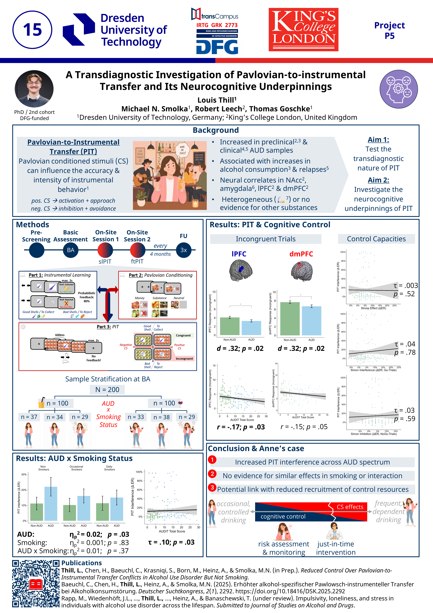

#  DFG Evaluation, 24.06.26 - 25.06.26

📄 Poster 15:  [A Transdiagnostic Investigation of Pavlovian-to-instrumental Transfer and Its Neurocognitive Underpinnings](./15_Thill_DFGevaluation.pdf)

presented by: [Louis Thill](https://github.com/louisthill/louisthill)

## 🗐References
1. Cartoni, E. et al. (2016). Appetitive Pavlovian-instrumental transfer: A review. *Neuroscience Biobehavioral Reviews*, 71, 829–848. **https://doi.org/10.1016/j.neubiorev.2016.09.020**
2. Chen, H., et al. (2021). Susceptibility to interference between Pavlovian and instrumental control is associated with early hazardous alcohol use. *Addiction Biology*, 26 (4), Article e12983. **https://doi.org/10.1111/adb.12983**
3. Chen, H. et al. (2023). Susceptibility to interference between Pavlovian and instrumental control predisposes risky alcohol use developmental trajectory from ages 18 to 24. *Addiction Biology*, 28(2), Article e13263. **https://doi.org/10.1111/adb.13263**
4. Chen, K. et al. (2023). The association of non–drug-related Pavlovian-to-instrumental transfer effect in nucleus accumbens with relapse in alcohol dependence: A replication. *Biological Psychiatry*, 93 (6), 558–565. **https://doi.org/10.1016/j.biopsych.2022.09.017**
5. Sommer, C. et al. (2020). Dysfunctional approach behavior triggered by alcohol-unrelated pavlovian cues predicts long-term relapse in alcohol dependence. *Addiction Biology*, 25, Article e12703. **https://doi.org/10.1111/adb.12703**
6. Garbusow, M. et al. (2019). Pavlovian-To-Instrumental Transfer and Alcohol Consumption in Young Male Social Drinkers: Behavioral, Neural and Polygenic Correlates, *Journal of Clinical Medicine*, 8(8),1188. **https://doi.org/10.3390/jcm8081188**
7. Garbusow, M. et al. (2022). Pavlovian-to-instrumental transfer across mental disorders: A review. *Neuropsychobiology*, 81 (5), 418–437. **https://doi.org/10.1159/000525579**

## ⚠️Recommended Further Reading:
Our group recently published a study on the reliability of our PIT paradigm:
- Belanger, M. J., Chen, H., Fröhner, J. H., Garbusow, M., Heinz, A., & Smolka, M. N. (2025). Behavioural and Neural Reliability of a Pavlovian-to-Instrumental Transfer Task. *Addiction Biology*, 30(12), e70112. **https://doi.org/10.1111/adb.70112**

## 📣Special thanks to:
- 💼My first supervisor, Michael N. Smolka, for his continuous guidance, support, and invaluable scientific mentorship throughout this project.
- 🌱The [IRTG 2773](https://transcampus.eu/project/mental-health/irtg2773/) for providing an outstanding interdisciplinary training environment, fostering scientific exchange and collaboration, and supporting my development as an early-career researcher.
